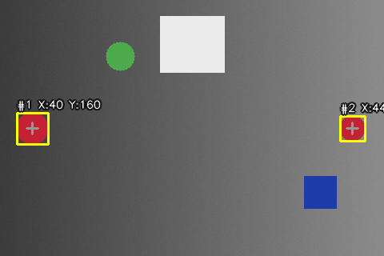

# Real-Time Colour Object Tracking (MATLAB + Python)

Tracks red, green or blue objects in a webcam feed or a video file. Each
object gets a bounding box, its centroid and its (x, y) position. The Python
version also keeps an **ID and motion trail** for every object across
frames.



*Generated by `scripts/make_demo.py`: two red balls are tracked with
separate IDs and trails. The green, blue and white objects are ignored.*

Built for *Image Processing and Data Visualization Using MATLAB*
(UE19CS257B) at PES University, 4th semester, by Mayuravarsha P and
Yashwal S Kanchan.

## How detection works

For a chosen colour channel *C* (red, green or blue):

1. **Difference image**: `C − grayscale`. A red object is bright in the red
   channel but only moderately bright in grayscale, so it stays positive.
   Whites and grays have equal channels and cancel to ≈ 0.
2. **3×3 median filter** removes salt-and-pepper sensor noise.
3. **Threshold** gives a binary mask. The thresholds are per colour
   (red 0.24, green 0.05, blue 0.15). Green needs the lowest because it has
   the largest weight in the grayscale formula (0.587 G), so its difference
   is the weakest: pure green gives 0.41, pure red 0.70, pure blue 0.89.
4. **Area filter** drops blobs smaller than 300 px.
5. **Connected components** (8-connectivity) give each object's bounding box
   and centroid.

### Tracking (Python version)

The MATLAB code finds blobs in each frame independently. `CentroidTracker`
links them over time. Each existing track claims the nearest new detection
within 80 px (greedy, closest pairs first). Leftover detections start new
tracks. A track survives up to 10 frames without a detection, so an object
can pass behind something briefly and keep its ID. Each track also stores
a trail of recent positions and an average speed in pixels per frame.

## Running

### Python

```bash
pip install -r requirements.txt
python -m colourtrack --colour red                          # webcam 0
python -m colourtrack --colour blue --source clip.mp4 --output tracked.mp4
python -m colourtrack --colour green --threshold 0.08 --min-area 150
```

Tests and demo:

```bash
pip install -r requirements-dev.txt
pytest                                    # 11 tests
PYTHONPATH=. python scripts/make_demo.py  # regenerates docs/demo.gif
```

### MATLAB

Requires the Image Processing Toolbox. Webcam input also needs the Image
Acquisition Toolbox.

```matlab
cd matlab
track_colour                        % asks for a colour, uses the webcam
track_colour('red')
track_colour('blue', 'clip.mp4')    % works on a video file too
stats = detect_colour_blobs(imread('photo.jpg'), 'green');
```

`final_version_original.m` is the script as it was submitted.

## Fixes over the original script

* The script defined a threshold for each colour but always used the blue
  one (`im2bw(diff_im, blueThresh)`), so red and green tracking used the
  wrong threshold. `detect_colour_blobs` now picks the threshold for the
  chosen colour.
* Detection is a separate function, so it can be reused and tested. The
  capture loop cleans up the camera even if the figure is closed early,
  and the same code runs on video files.
* `im2bw` (deprecated) is replaced by `imbinarize`.

## Limitations

* `channel − gray` measures how much a colour dominates, not its hue.
  **Orange is detected as red** and **yellow as green**. Converting to HSV
  and thresholding the hue would separate them.
* Fixed thresholds depend on the lighting and the camera's white balance.
* Greedy nearest-centroid matching can swap IDs when two objects of the same
  colour touch. A Kalman filter with Hungarian assignment would handle that
  better.

## Layout

```
matlab/        detect_colour_blobs.m, track_colour.m, original script
colourtrack/   Python port: detect.py, tracker.py, CLI (__main__.py)
tests/         pytest suite
scripts/       make_demo.py (synthetic scene -> docs/demo.gif)
docs/          project report, demo animation
```
